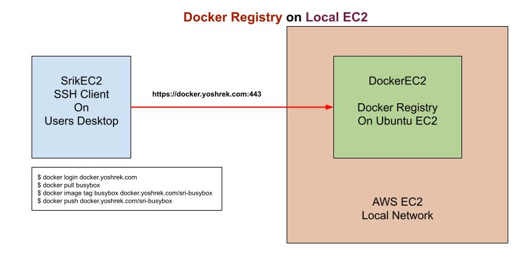
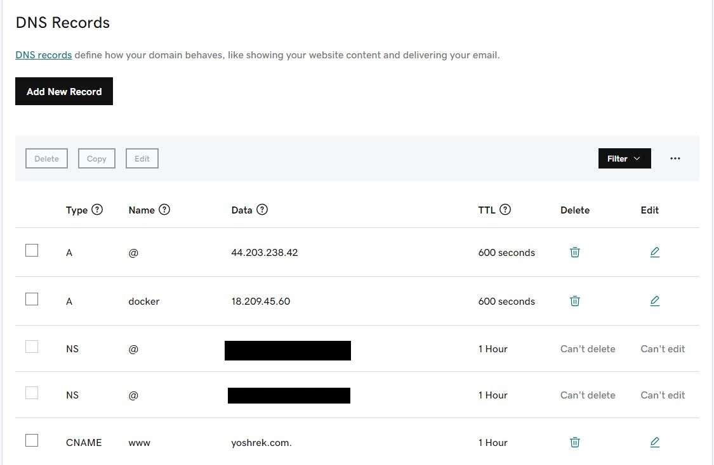

# Create you personal Docker Hub Registry on AWS EC2 Instance
---


#### Below is a diagram shown how Docker HUB Local Registry on AWS EC2 is setup



#### 1. Create t2.medium, Ubuntu 22.04 AWS EC2 Instance and Allow 80, 443 in Security Groups Inbound Traffic Rules

#### 2. Run below command to install docker and "docker compose" software:
```
git clone https://github.com/wrkbase/docker-ec2-registry.git
cd docker-ec2-registry
chmod 755 ec2software.sh
./ec2software.sh
sudo reboot --reboot
```

#### 3. Updating DNS Entries in your Hosting Provider CPanel
```
Run below command to get the IP Address of EC2:
wget -qO- http://instance-data/latest/meta-data/public-ipv4; echo
```



#### 4.  After the system is rebooted, execute the below commands to setup the Docker Registry Server on EC2
```
cd docker-ec2-registry

-- Update and replace all docker.yoshrek.com with docker.yourdomain.com in the makefile
-- Update and replace all wkbase@gmail.com with email@yourdoamin.com in the makefile
make setup-docksrvr
make start-docksrvr
```

#### 5. Create t2.small, Ubuntu 22.04 AWS EC2 Instance and Allow 80, 443 in Security Groups Inbound Traffic Rules

#### 6. Run below command to install docker and "docker compose" software:
```
git clone https://github.com/wrkbase/docker-ec2-registry.git
cd docker-ec2-registry
chmod 755 ec2software.sh
./ec2software.sh
sudo reboot --reboot
```

#### 7. After the system is rebooted, execute the below commands to setup the Docker Registry Server on EC2
```
cd docker-ec2-registry

-- Update and replace all docker.yoshrek.com with docker.yourdomain.com in the makefile
-- Update and replace all wkbase@gmail.com with email@yourdoamin.com in the makefile
make setup-dockclnt
make setup-dockclnt-rem
```


#### 8. In Order to test that your remote Docker Registry EC2 Server is working, execute the below commands on your SSH Client system:
```
docker login docker.yourdomain.com
docker images
docker pull busybox
docker images
docker image tag busybox docker.yourdomain.com/sri-busybox
docker push docker.yourdomain.com/sri-busybox
```


#### 9. After the above step for pushing your local image to the Docker Registry Server from the SSH Client system, you can execute below commands on your Docker Registry EC2 Server, to check if the image has been pushed properly
```
docker login docker.yourdomain.com
-- Use testuser for User and password for Password to login

-- Testing docker pull on Docker Registry Server
docker ps
docker images
docker pull docker.yourdomain.com/sri-busybox
docker images
```


---
### Notes :
---

#### .netrc for git pushing
```
$ cat ~/.netrc
machine github.com
        login wrkbase
        password GHPkgBDssFYHaILmDgcUj6saq8zvYKF2LpHc4
```
#### To view git modifications status
```
git status
```

#### To view git pushed status to origin
```
git log --name-status
```

#### To push to git repo
```
git add . && git commit -m "Updating latest docs and code" && git push origin
```

#### To revert to previous commit state
```
git reset --hard HEAD~1
git log --name-status
git push -f -u origin
OR
git push -f -u origin main
```


**Setting up bash script for alias commands** 

ubuntu:~$ cat shcut.sh

```
alias cls='clear'
alias scn='screen'
alias gitusr='git config --global user.name "Srikanth Pen"'
alias giteml='git config --global user.email "wrkbase@gmail.com"'
alias gitlst='git config --list --global'
alias gtcl='git clone https://github.com/wrkbase/docker-ec2-registry.git'
alias frgrp='for i in `find src -name "*.js"`; do echo $i ===========================; grep "createUser" $i; done'
alias frdif='for i in `find . -name "*.ORG"`; do echo $i =====================================; fl=`echo $i | sed 's/.ORG$//'`; diff --color $i $fl; done'
alias diffc='diff --color'
alias gits='git status'
alias gitns='git log --name-status'
alias gitdc='git log --graph --all --decorate --pretty="%Cred%h%Creset -%C(auto)%d%Creset %s %Cgreen(%ad) %C(bold blue)<%an>%Creset" --date=short'
alias gitcomm='git status; git checkout -b main; git add . ; git commit -m "Docker Registry Code and Docs"; git push -u origin main; git status;'
alias gitfrc='git push -f -u origin main'
```

---


